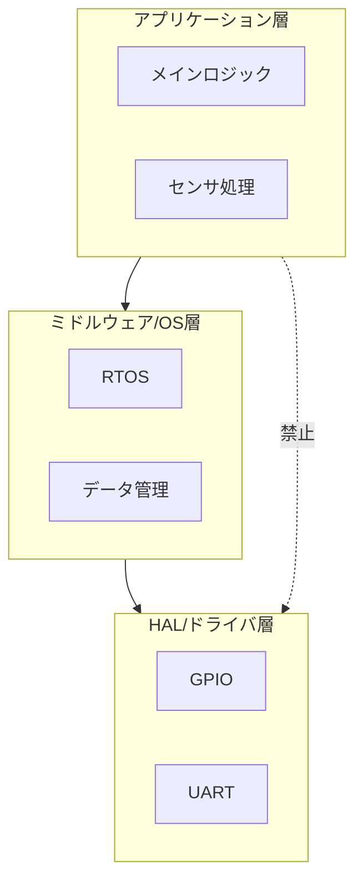

# 組込みソフトウェア基本設計書 (Basic Design)

## 1. はじめに

### 1.1. 本書の目的
システム全体のアーキテクチャ、リソース割り当て、および共通の設計方針を定義する。

### 1.2. 準拠する要求仕様
[要求仕様書ID/リンク]

### 1.3. 用語定義
プロジェクト固有の略語リスト。

### 1.4. 構成管理とトレーサビリティ
どの単位でコードを管理するか（Gitのリポジトリ単位など）、トレーサビリティをどんな方法で担保するか。
## 2. システム構成とソフトウェア・アーキテクチャ

### 2.1. 開発・ビルド環境前提
* **静的解析ツールの採用有無とルール:** ツールチェーン、SDK、ライブラリなど。

### 2.2. ハードウェア前提条件
*   **MCU:** [マイコン型番] / クロック: [Main xxMHz, Sub xxkHz]
*   **電源構成:** 電圧変動範囲、および低電圧検知(LVD)の設定値。

システムの静的構造と、レイヤー間の依存ルールを定義する。

### 2.3. レイヤー構造（静的構造）

*   **設計方針:** アプリ層からドライバ層への直接アクセスを禁止し、移植性を高める。

## 3. 実行制御設計（動的構造）
システムがどのように並行動作し、リソースを分け合うかを定義する。

### 3.1. 実行スケジュール（タスク/メインループ）
タスク一覧の例：
| タスク名 | 優先度 | 周期 | スタックサイズ | 役割 |
| :--- | :--- | :--- | :--- | :--- |
| Task_Main | High | 10ms | 512B | センサーサンプリング・制御計算 |
| Task_Comm | Mid | 100ms | 1024B | 上位システムとの通信処理 |

実行スケジュールはRTOSを使わない場合はメインループ（ベアメタル）型の実行スケジュールを採用します。

### 3.2. 割り込み (ISR) 設計
*   **割込優先度方針:** 通信エラー検知を最優先とする。
*   **排他制御:** 共有変数アクセスにはセマフォ/ミューテックスを使用する。

### 3.3. ユーザーインターフェース（UI/HMI）制御方針
チャタリング防止やバックライト制御などの共通ルールをBD（基本設計）レベルで定義

## 4. リソース設計
システムテスト（ST）の合格基準となる制約値を定義する。

### 4.1. メモリマップ
*   **ROM/Flash:** プログラム、定数データ、フォントデータの配置。
*   **RAM:** スタック領域、ヒープ領域、静的変数の配置。
*   **不揮発メモリ (EEPROM/Flash):** 設定値、エラーログの保存レイアウト。

### 4.2. パフォーマンス目標
*   **CPU負荷率:** 平均50%以下、ピーク時80%以下、など。
*   **起動時間:** 電源投入からReady状態まで500ms以内、など。
*   **エンドツーエンドの応答遅延許容値:** 割込応答遅延、システム全体での端子入力〜出力間(E2E)最大遅延時間を定義。
## 5. 共通基盤・エラーハンドリング方針
個別機能によらない、システム全体の「振る舞いのルール」を定義する。

### 5.1. 異常検知と復帰の方針
*   **WDT監視:** Task_Main内で定期的にクリア。ハングアップ時はシステムリセット。
*   **フェイルセーフ:** 重大エラー検知時、全アクチュエータをLow(安全側)に固定。

### 5.2. ログ・診断仕様
*   **デバッグログ:** UART経由で出力する共通フォーマットの定義。
*   **自己診断:** 範囲

### 5.3. 再起動・初期化戦略
*   **リセットハンドリング:** 電源投入、WDTリセット、ソフトウェアリセット、低電圧検知時のそれぞれの挙動の差別化。シャットダウン/スリープ移行時の保存処理。

### 5.4. 安全・法規制への対応（ASIL/SIL等）
そのシステムが遵守すべき安全基準（ISO 26262, IEC 61508等）の有無。メモリエラー（ECC）発生時の処置など。

## 6. 通信・ネットワーク基盤設計
*   **CAN/Ethernet基本設定:** ボーレート、通信周期の許容誤差、ターミネータの有無。
*   **セキュリティ方針:** セキュアブートの有無、データの暗号化方針。

## 7. ビルド・デプロイ仕様
*   **ツールチェーン:** [コンパイラ名/バージョン]
*   **最適化方針:** 「サイズ優先」か「速度優先」か。
*   **バイナリ形式:** 生成するファイル形式（.mot, .hex, .bin）とチェックサムの埋め込み位置。
