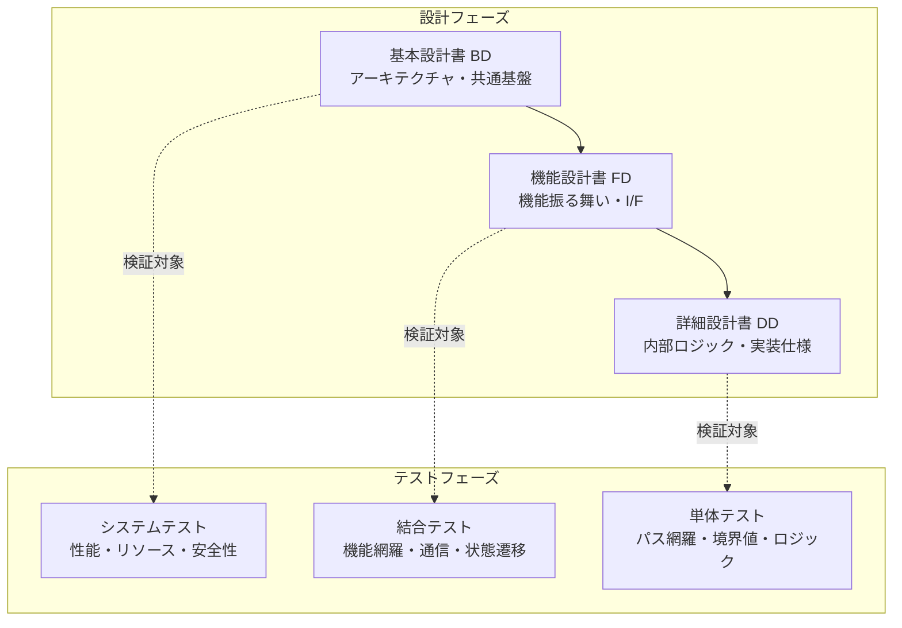
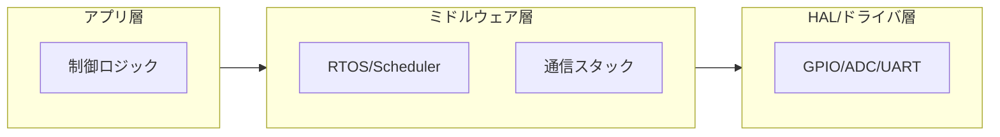
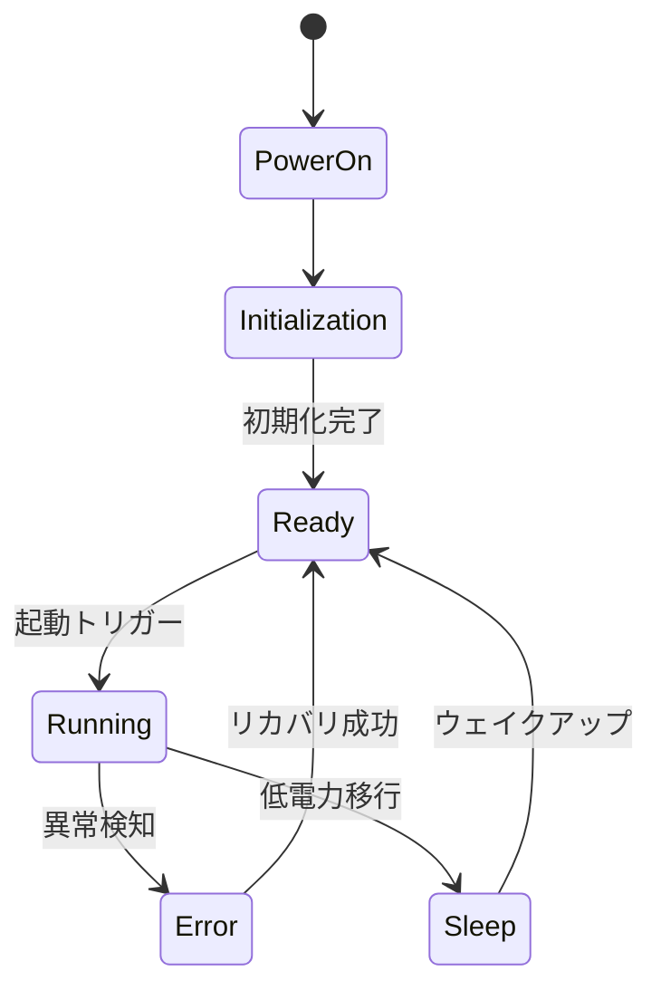
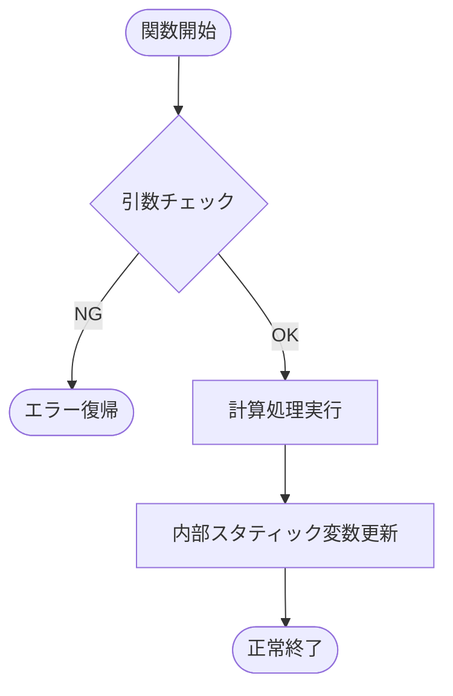

## 0. 本書の目的
組込みソフトウェア開発における3層の設計書（基本・機能・詳細）の作成戦略を、構造的かつ実務に即した形でまとめた。

各設計書を「独立した文書」ではなく、<b>V字モデルのテスト工程と対になる「検証の設計図」</b>として定義することが成功の鍵となります。

---

## 1. 全体俯瞰：設計書の階層構造とテストの対応
まず、各設計書がどの工程をカバーし、どのテストと紐付くかを定義します。

---

## 2. 基本設計書 (Basic Design) 
**【目的】システムの骨組み(静的・動的アーキテクチャ)と制約を決定する**
「どのようにソフトウェアが配置され、リソースを分け合うか」というアーキテクチャに特化します。
個別の機能には深入りせず、システム全体が「どのような器（プラットフォーム）」で動くかを記述します。

### 記述の重点項目
* **ソフトウェア層構成:** HAL$^{※1}$、ミドルウェア、アプリケーションの依存関係。レイヤ図、タスク構成図をmermaid記法で記述する。
* **リソース設計:** メモリマップ、スタック・ヒープ量、CPU負荷率の目標値。
* **タスク/割込み設計:** 優先順位、周期、排他制御の方針。
* **エラーハンドリング方針:** ウォッチドッグタイマ監視、共通エラーログ。
 ※ HAL【Hardware Abstraction Layer】：ハードウェア抽象化レイヤー。ハードごとのしようの違いを吸収して共通の方法で扱えるようにするソフト部品のこと。

### 構造図の例

---

## 3. 機能設計書 (Functional Design) 
**【目的】要求を「機能」「入出力」「状態遷移」として具体化**
「何をするか（What）」を機能として記述します。ハードウェアの詳細やコードのロジックには踏み込まず、ユーザーや外部機器から見た振る舞いと、入出力の因果関係、状態遷移を完全定義することで、後戻りとなる抜け漏れを排除します。

### 記述の重点項目
* **機能ブロック図:** データの流れ（Data Flow）の可視化。
* **外部インターフェース:** 通信メッセージ（CAN/SPI等）のデータ型、単位、スケーリング。
* **システム状態遷移:** パワーモード（Sleep/Run）やシステム状態（Init/Normal/Error）。
* **要求トレーサビリティ:** SRS（要求仕様）のIDとの紐付け。

### 状態遷移の例

---

## 4. 詳細設計書 (Detailed Design)
**【目的】実装の曖昧さを排除し、単体テストを可能にする**
「どう実装するか（How）」を記述します。この文書があれば、プログラマが迷わずにコードを書け、テスターが単体テスト項目を作れるレベルまで落とし込みます。
プログラミング言語等の関数単位での設計となります。

### 記述の重点項目
* **モジュール仕様:** 関数の一覧、引数、戻り値、副作用。
* **内部アルゴリズム:** 複雑な計算式、条件分岐、ループ処理、モジュール内状態遷移。
* **データ構造:** 構造体、列挙型、グローバル変数の定義。
* **単体テスト仕様への配慮:** 境界値（MAX/MIN）や異常系パスの明記。
* **エラーコード:** モジュールが返す具体的な戻り値と、異常系の処理パス。

### 処理フローの例

---

## 5. 設計書間の整合性チェックリスト

| 項目 | 検討すべきポイント |
| :--- | :--- |
| **粒度の分離** | 詳細設計に書くべき「if文の条件」が機能設計に混ざっていないか？ |
| **リソースの意識** | 基本設計で決めた「タスク周期」内に機能設計の処理が収まるか？ |
| **例外の連鎖** | 詳細設計で検知したエラーが、基本設計で決めたエラーハンドラに正しく通知されるか？ |
| **検証可能性** | その設計書の記述を元に、客観的な「合格/不合格」の判定ができるか？ |

---

### プロジェクトマネジメントへの応用
これらの設計書を分割して管理することで、**「基本設計が終わった段階でハードウェア発注やリソース見積もりを行い、機能設計が終わった段階でテスト仕様書の作成を開始する」**といった並行開発（コンカレント・エンジニアリング）が可能になります。

特に車載プロジェクトなどの場合、これらをAutomotive SPICE等のプロセスに則ってトレーサビリティを持たせることが、品質保証の最短ルートとなります。