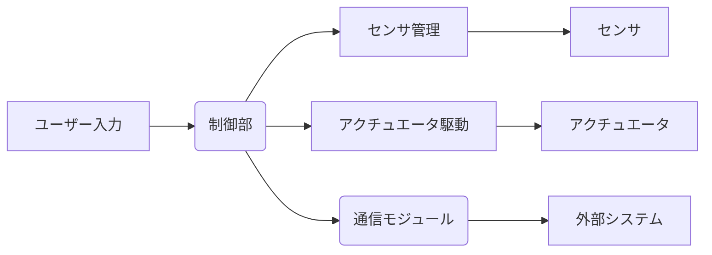
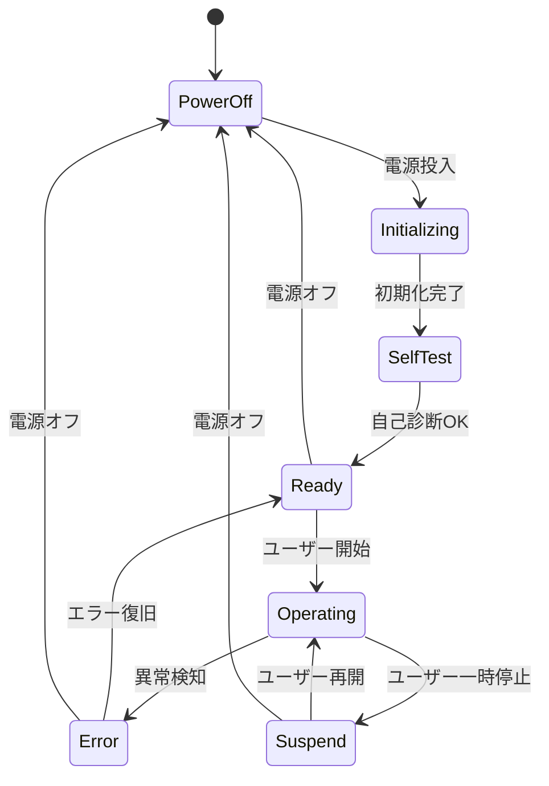
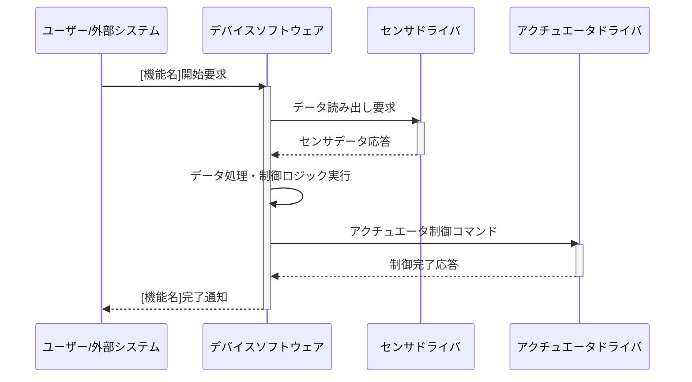

# 組込みソフトウェア機能設計書 (Functional Design)

## 1. はじめに

### 1.1. 本書の目的
本設計書は、システムが提供する個々の機能、外部インターフェース、およびシステムの状態遷移を具体的に定義することを目的とする。Basic Design (BD) で定められたアーキテクチャと制約の範囲内で、ユーザーや外部システムから見たソフトウェアの振る舞いを明確にする。

### 1.2. 準拠する基本設計書
[基本設計書ID/リンク]

### 1.3. 準拠する要求仕様
[要求仕様書ID/リンク]

### 1.4. 用語定義
プロジェクト固有の略語リスト、および機能設計レベルで新しく定義される用語。

## 2. 機能概要
システムが提供する機能の全体像と、要求仕様とのマッピングを記述する。

### 2.1. 機能一覧
システムが提供する主要な機能の一覧を、その概要と要求仕様IDと共に記述する。

| 機能名 | 概要 | 要求仕様ID |
| :--- | :--- | :--- |
| [機能A] | [機能Aの簡単な説明] | [REQ_001] |
| [機能B] | [機能Bの簡単な説明] | [REQ_002] |

### 2.2. 機能ブロック図
システム内の主要な機能ブロックと、それらの間のデータの流れを図で示す。

## 3. 外部インターフェース設計
外部システムやハードウェアとの間でやり取りされるデータ、信号、メッセージの詳細を定義する。

### 3.1. 物理インターフェース
使用する物理インターフェース（CAN, UART, SPI, I2C, GPIO等）とその基本的な仕様を定義する。

*   **CANインターフェース:**
    *   メッセージID範囲: [0x100 - 0x1FF]
    *   データフォーマット: CAN_FD / CAN_2.0B
    *   通信フレームの同期方式: [イベント駆動 / 周期通信]

### 3.2. 通信メッセージ定義
各通信インターフェースで送受信されるメッセージのデータ構造、データ型、単位、スケーリング、有効範囲を定義する。メッセージ単位での定義を行う。

*   **[メッセージ名] (CAN ID: [0x123])**
    *   送信周期/トリガー: [100ms周期 / [イベント名]発生時]
    *   データ項目一覧:

    | 項目名 | データ型 | 単位 | 範囲 | 備考 |
    | :--- | :--- | :--- | :--- | :--- |
    | SensorValue | uint16 | mV | 0 - 5000 | センサ生値 |
    | StatusFlag | bit | - | 0, 1 | 状態フラグ (0:Normal, 1:Error) |

### 3.3. 外部API/サービスインターフェース
上位システムや他のソフトウェアコンポーネントが利用するAPIやサービスについて、引数、戻り値、エラーコード、呼び出し規約を定義する。

## 4. システム状態遷移設計
システムの動作モードや状態がどのように変化するかを定義する。

### 4.1. システム状態一覧
システムの取り得る主要な状態とその定義を記述する。

*   **[状態名A]:** [状態Aの定義と振る舞い]
*   **[状態名B]:** [状態Bの定義と振る舞い]

### 4.2. 状態遷移図
システムの状態とその間の遷移条件、および遷移によって発生するアクションを図で示す。

### 4.3. 各状態での振る舞い
各システム状態で、システムがどのような振る舞いをするか（例：タスクの起動/停止、インターフェースの有効/無効）を記述する。

## 5. 機能動作シーケンス
個々の機能について、外部との相互作用や内部の主要な処理フローをシーケンス図で詳細に記述する。

### 5.1. [機能名] シーケンス

## 6. エラー処理 (機能レベル)
各機能が検知すべきエラーとその対応（外部への通知、機能の部分停止など）を定義する。Basic Design (BD) のエラーハンドリング方針に則る。

## 7. 要求トレーサビリティ
各機能要件がこの機能設計書のどの部分で満たされているかを明確にする。要求仕様IDと設計項目のマッピングを記述する。
