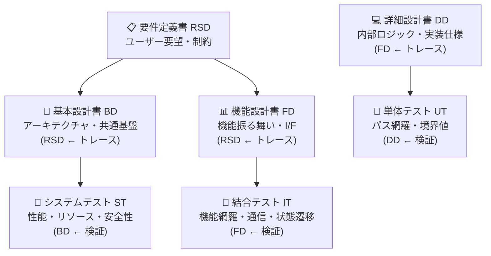

# 要件定義書 (Requirements Specification Document, RSD/SRS)

## 0. 本書の目的
組込みソフトウェアプロジェクトにおいて、ユーザーの要望や製品仕様を客観的で検証可能な「要求事項」として定義する。

本書は、**V字モデルの要件定義段階に対応し、後続の基本設計・機能設計・詳細設計、および各テスト工程への「トレーサビリティの起点」**となります。

---

## 1. はじめに

### 1.1. 本書の目的
本要件定義書は、[プロジェクト名]の開発にあたって、ユーザーが要求する機能、性能、安全性、その他の制約条件を明確かつ検証可能な形で定義することを目的とします。

本書の記述内容は、後続の設計フェーズ（基本設計・機能設計・詳細設計）およびテストフェーズの**承認基準**となります。

### 1.2. プロジェクト情報
*   **プロジェクト名:** [プロジェクト名]
*   **製品・システム名:** [製品名]
*   **対象ユーザー/顧客:** [顧客名/部門]
*   **開発期間:** [開始日] ～ [終了予定日]
*   **担当チーム:** [チーム名/責任者]

### 1.3. 本書の適用範囲（スコープ）
本書が対象とするシステムの範囲を明確に定義します。

*   **対象システム:** [どの機能・モジュール・レイヤーが対象か]
*   **対象外（Out of Scope）:** [明確に対象外であることを記述]
*   **将来対応予定:** [今回は含まず、将来の拡張対象となる機能]

### 1.4. 用語定義・略語
プロジェクト固有の専門用語、略語、アクロニムを定義します。

| 用語 | 定義 | 備考 |
| :--- | :--- | :--- |
| [用語A] | [定義] | [参照先] |
| RSD | Requirements Specification Document (要件定義書) | 本文書 |
| SRS | System Requirements Specification | RSDと同義 |

### 1.5. 関連文書・参考資料
*   [市場仕様書] (Document ID: [xxx])
*   [顧客との契約書/RFQ] (Document ID: [yyy])
*   [標準・規格] (ISO 26262, IEC 61508, AUTOSAR等)

---

## 2. ビジネス・背景情報

### 2.1. ビジネス背景
*   **市場機会/問題の背景:** なぜこのシステムが必要か、どのような問題を解決するか
*   **対象市場/ユーザーセグメント:** [顧客層、利用シーン]
*   **競合製品との差別化ポイント:** [競合と比較して、どのような機能/性能で差別化するか]

### 2.2. 制約・前提条件
*   **プラットフォーム前提:** [対象MCU、OS、既存システムとの連携の有無など]
*   **法的・規制上の制約:** [ASIL/SIL等の安全基準、電波法、医療機器認証等]
*   **コスト・スケジュール制約:** [BOM上限、開発費用上限、納期]

---

## 3. 要求事項（Functional Requirements）

### 3.1. システム概要・ミッション
システムが果たすべき主たるミッション・機能の全体像を簡潔に記述します。

*   **システムミッション:** [システムが達成すべき目標を1～2文で記述]
*   **ユーザーシナリオ:**
    -   [シーン1: 誰が、いつ、どのような目的で使うか]
    -   [シーン2: 別のユースケース]

### 3.2. 機能要求
ユーザーやシステムが必要とする個々の機能を記述します。各要求には **要求ID** を付与し、後続の設計書・テスト仕様との**トレーサビリティ**を確保します。

#### 3.2.1. [機能カテゴリ A]

| 要求ID | 要求内容 | 優先度 | 備考 |
| :--- | :--- | :--- | :--- |
| **REQ_F_001** | [機能Aについての要求。SMART原則に従い、検証可能であることを確認する] | 必須 | [設計書での対応: BD §2.1 など] |
| **REQ_F_002** | [機能Bについての要求] | 必須 | |
| **REQ_F_003** | [機能Cについての要求。条件付きで実装] | オプション | 将来拡張 |

#### 3.2.2. [機能カテゴリ B]

| 要求ID | 要求内容 | 優先度 | 備考 |
| :--- | :--- | :--- | :--- |
| **REQ_F_010** | [別の機能カテゴリでの要求] | 必須 | |

### 3.3. 外部インターフェース要求
外部システムやハードウェアとの通信・接続に関する要求を記述します。

| 要求ID | 要求内容 | 優先度 |
| :--- | :--- | :--- |
| **REQ_IF_001** | [通信プロトコル (CAN/UART/Ethernet等) の種類と基本仕様] | 必須 |
| **REQ_IF_002** | [通信速度、遅延許容値] | 必須 |
| **REQ_IF_003** | [接続形態（有線/無線、ネットワークトポロジー）] | 必須 |

### 3.4. データ・メッセージ要求
システムが処理すべきデータの種類、量、形式に関する要求を記述します。

| 要求ID | 要求内容 | 優先度 |
| :--- | :--- | :--- |
| **REQ_DATA_001** | [入力データの型：センサ値は 16bit 整数、範囲 0～5000mV] | 必須 |
| **REQ_DATA_002** | [出力データフォーマット：CAN メッセージ、ID=0x123、8バイト] | 必須 |
| **REQ_DATA_003** | [サンプリングレート：10msごと、最大遅延 20ms] | 必須 |

---

## 4. 非機能要求（Non-Functional Requirements）

### 4.1. 性能要求
システムが満たすべき性能（スピード、容量、スループット）の要求を記述します。

| 要求ID | 要求内容 | 目標値 | テスト方法 |
| :--- | :--- | :--- | :--- |
| **REQ_PERF_001** | CPU負荷率（平均/ピーク） | 平均50% / ピーク80% 以下 | 負荷測定テスト |
| **REQ_PERF_002** | メモリ使用量 (RAM/ROM) | RAM: 32KB以下, ROM: 128KB以下 | メモリマップレポート |
| **REQ_PERF_003** | 応答遅延（入力から出力まで）| 100ms以下 | E2E遅延測定 |
| **REQ_PERF_004** | システム起動時間 | 電源投入から Ready 状態まで 500ms以内 | 起動時間測定 |

### 4.2. 信頼性・可用性要求
システムの信頼性、故障復旧、保守性に関する要求を記述します。

| 要求ID | 要求内容 | 目標値 | 備考 |
| :--- | :--- | :--- | :--- |
| **REQ_REL_001** | 連続運用時間 (Mean Time Between Failure, MTBF) | 10,000時間以上 | 実運用環境での信頼性試験により検証 |
| **REQ_REL_002** | エラーハンドリング・復旧機能 | ハング状態が30秒以上続かないこと | WDTにより自動リセット |
| **REQ_REL_003** | エラーログ記録 | システムエラーをすべて不揮発メモリに記録 | ログバッファ容量: 1000レコード |

### 4.3. 安全性・セキュリティ要求
システムが遵守すべき安全基準、セキュリティ対策を記述します。

| 要求ID | 要求内容 | 根拠 | 実装例 |
| :--- | :--- | :--- | :--- |
| **REQ_SAFETY_001** | 車載安全基準 ISO 26262 ASIL B 対応 | 自動車向け製品 | 形式手法による検証、定期的な診断機能 |
| **REQ_SAFETY_002** | 重大エラー検知時のフェイルセーフ動作 | 安全要件 | 全アクチュエータを安全状態(Low)に設定 |
| **REQ_SAFETY_003** | メモリエラー検知（ECC/パリティ） | ASIL要件 | ECC付きメモリまたはソフトウェアパリティチェック |
| **REQ_SEC_001** | セキュアブート対応 | セキュリティポリシー | ファームウェアデジタル署名・検証 |

### 4.4. 保守性・テスト容易性要求

| 要求ID | 要求内容 | 優先度 |
| :--- | :--- | :--- |
| **REQ_MAINT_001** | ユニットテストカバレッジ 80% 以上 | 必須 |
| **REQ_MAINT_002** | コード静的解析ツール (MISRA-C等) による分析 | 必須 |
| **REQ_MAINT_003** | デバッグポート (UART) による診断情報出力機能 | 必須 |

### 4.5. 移植性・互換性要求

| 要求ID | 要求内容 | 優先度 |
| :--- | :--- | :--- |
| **REQ_PORT_001** | [複数のMCU型番への対応: STM32H7xx, STM32F4xx] | 必須 |
| **REQ_PORT_002** | [RTOS依存性を最小化し、別のRTOSへの移植が可能] | 重要 |

---

## 5. 制約条件・非要求（Constraints）

### 5.1. 技術的制約
*   **ハードウェアプラットフォーム制約:**
    -   対象MCU: [型番]、クロック周波数: [MHz]、メモリ容量: [KB]
*   **開発ツール/言語:** C言語、コンパイラ [name/version]
*   **既存資産の継承:** 既存OSやミドルウェアとの互換性維持

### 5.2. ビジネス・スケジュール制約
*   **納期:** [YY年MM月]
*   **マイルストーン:** [要件確定: MM月, 設計完了: MM月, リリース: MM月]
*   **予算上限:** [BOM、開発費用]

### 5.3. 標準・規格の適用
*   **適用する規格:** AUTOSAR, ISO 26262, MISRA-C 等
*   **品質マネジメント:** ISO 9001, Automotive SPICE 等

---

## 6. 非要求（Out of Scope）

明確に本プロジェクトの対象外とする項目を記述することで、誤解を防ぎます。

| 項目 | 理由 |
| :--- | :--- |
| [機能/要求X] | [対象外の理由] |
| ワイヤレス通信 | 次期バージョンでの拡張予定 |

---

## 7. ユースケース・シーケンス

### 7.1. 主要ユースケース
ユーザーが実際にシステムを使用する主要なシーン/流れを記述します。

#### UC-001: [ユースケース名]
*   **アクター:** [ユーザー/外部システム]
*   **事前条件:** [システムがどの状態にあるか]
*   **主流シーケンス:**
    1. [ステップ1]
    2. [ステップ2]
    3. [ステップ3]
*   **代替フロー:** [例外シーン、エラー時の流れ]
*   **事後条件:** [ユースケース終了後のシステム状態]

#### UC-002: [別のユースケース]
*   [同様の形式で記述]

---

## 8. 要求の優先度・実装計画

### 8.1. 優先度の定義
本書では、以下の優先度を適用します。

| 優先度 | 定義 | 実装時期 |
| :--- | :--- | :--- |
| **必須 (M: Must)** | リリースに必須。実装しない場合は出荷不可 | V1.0 |
| **重要 (S: Should)** | リリースに含めることが望ましい。実装できない場合は代替案で対応 | V1.0 or V1.1 |
| **オプション (C: Could)** | あると望ましいが、必須ではない | V1.1以降 |
| **将来 (W: Won't)** | 現在のリリースでは実装しない | V2.0以降 |

### 8.2. 実装ロードマップ
優先度に基づいた実装計画を示します。

*   **V1.0 (GA):** REQ_F_001, REQ_F_002, REQ_IF_001, REQ_PERF_001～003 を実装
*   **V1.1 (保守版):** REQ_F_003, REQ_F_010 を追加
*   **V2.0 (拡張版):** 追加機能とし、本書の改版時に記述

---

## 9. トレーサビリティ・検証計画

### 9.1. 要求トレーサビリティマトリックス (RTM)
各要求がどの設計書、テスト仕様に対応しているかをマッピングします。

| 要求ID | 要求内容 | 基本設計 | 機能設計 | 詳細設計 | 単体テスト | 結合テスト | システムテスト |
| :--- | :--- | :--- | :--- | :--- | :--- | :--- | :--- |
| REQ_F_001 | [要求] | BD §2.1 | FD §2.1 | DD §3.1 | UT_001 | IT_001 | ST_001 |
| REQ_F_002 | [要求] | BD §2.2 | FD §2.2 | DD §3.2 | UT_002 | IT_002 | ST_002 |

### 9.2. 検証方法の定義
各要求がどのような方法で検証されるかを記述します。

| 要求ID | 検証方法 | 合格基準 | 検証責任者 |
| :--- | :--- | :--- | :--- |
| REQ_PERF_001 | 実装後のCPU負荷測定 | 平均50%, ピーク80%以下 | テストチーム |
| REQ_SAFETY_001 | 形式検証, 静的解析ツール実行 | ツール警告ゼロ | QA部門 |

---

## 10. 変更管理・版管理

### 10.1. 版履歴
本文書の変更履歴を記録します。

| 版 | 日付 | 変更内容 | 変更者 |
| :--- | :--- | :--- | :--- |
| 0.1 | [YY/MM/DD] | 初版ドラフト作成 | [名前] |
| 0.2 | [YY/MM/DD] | 顧客レビュー指摘を反映 | [名前] |
| 1.0 | [YY/MM/DD] | 顧客承認・確定版 | [名前] |

### 10.2. 変更要求プロセス
要件定義書が確定した後に、要求の追加・変更が発生した場合のプロセスを定義します。

*   **変更要求の申請:** 変更理由、影響範囲をCCB(Change Control Board)に提出
*   **CCB審査:** リスク・スケジュール・コスト影響を検討し、承認/却下を決定
*   **版番号の更新:** 承認後、版番号を更新し、すべての関連文書に反映

---

## 付録 A: 参考資料

*   [ISO/IEC/IEEE 29148:2018] - System and software engineering — Life cycle processes — Requirements engineering
*   [AUTOSAR] - AUTomotive Open System ARchitecture
*   [ISO 26262] - Functional Safety in Automotive
*   [MISRA-C] - Motor Industry Software Reliability Association

---

## 付録 B: 要求テンプレート・ガイドライン

### B.1. 要求文の書き方（SMART原則）
良い要求は、以下の特性を持ちます。

*   **Specific（具体的）:** あいまいさがなく、誰が読んでも同じ解釈ができる
*   **Measurable（測定可能）:** 「ほぼ」「大体」ではなく、具体的な数値・基準を記述
*   **Achievable（実現可能）:** 技術的に実現不可能な要求でないこと
*   **Relevant（関連性がある）:** ビジネス目標や顧客ニーズに関連している
*   **Time-bound（期限がある）:** リリース版、開発期間の明記

### B.2. 悪い要求の例と改善例

| 悪い例 | 改善例 |
| :--- | :--- |
|「レスポンスが早いこと」 | 「ユーザー入力から画面表示まで 100ms以内であること」|
| 「信頼性が高いこと」 | 「MTBF 10,000時間以上、ハング状態が 30秒以上続かないこと」|
| 「かんたんに使えること」 | 「ユーザーは事前トレーニングなしに 10分以内に操作開始できること」|

---

**承認者:**

| 役職 | 名前 | 署名 | 日付 |
| :--- | :--- | :--- | :--- |
| プロジェクトマネージャー | [名前] | ________ | [日付] |
| 技術リーダー | [名前] | ________ | [日付] |
| 顧客代表 | [名前] | ________ | [日付] |
